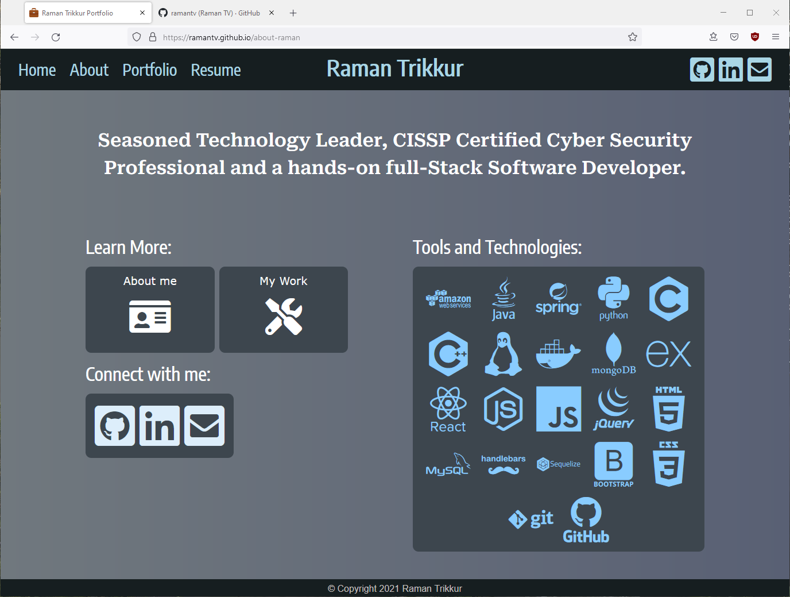

# about-raman
Portfolio for Raman TV

## Table of contents
  - [General info](#general-info)
  - [Deployed Application](#deployed-application)
  - [Screenshots](#screenshots)
  - [Technologies](#technologies)
  - [Setup](#setup)
  - [Licenses](#licenses)
  - [Developer(s)](#developers)
  
## General info
This is Raman's personal portfolio website written using JavaScript, HTML, and React.  The Bootstrap CSS framework was used for page styling. 

## Deployed Application
[About-Raman](https://ramantv.github.io/about-raman)

## Screenshots

## Technologies
* HTML 
* CSS
* Bootstrap
* JavaScript
* Node.js
* React

## Setup
* Link to Repository: https://github.com/ramantv/about-raman
* Clone GitHub repository.
* run 'npm install'.
* Run 'npm start' to start the application.

## Licenses
 
 

## Developer(s)
* [Raman TV.](https://github.com/ramantv)
  

  
